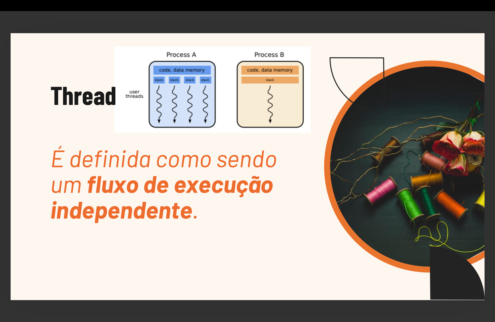
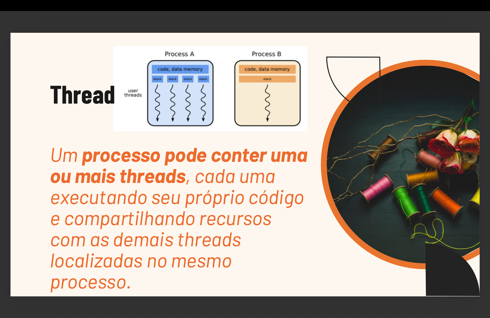
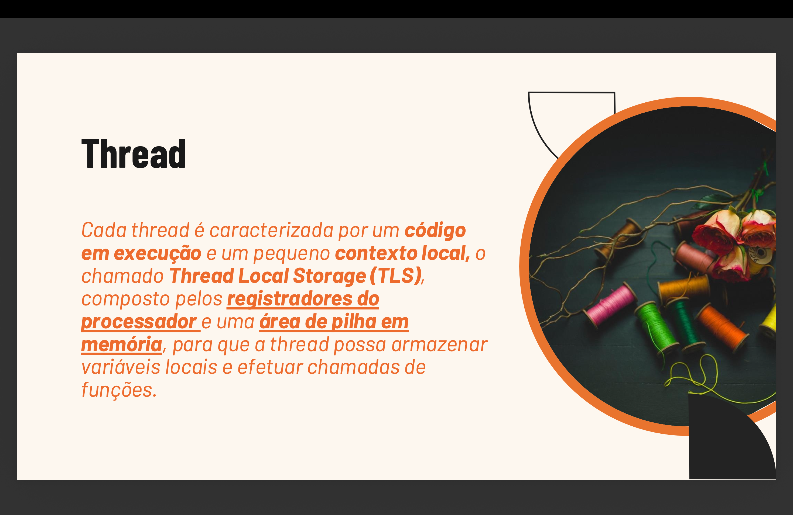
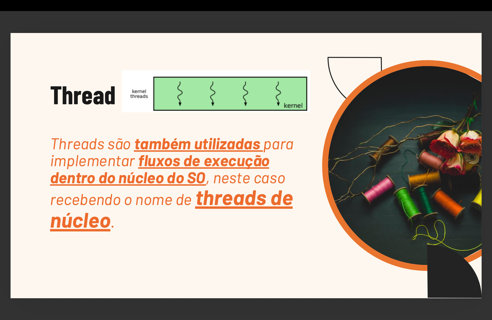
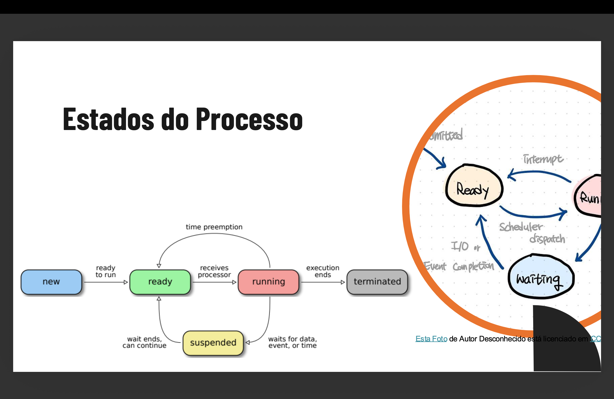

<h1 align="center"> Mesa de DJ — Simulador Multithread em C++ <br>
<br>


[](./LICENSE)

</h1>

<h2 align="center">👥👨🏻‍🏫 Docente Responsável: <br>
</h2>
<ul>
  <li><strong>Raoni Monteiro de Oliveira</strong> <a href="https://www.linkedin.com/in/raonimonteirodeoliveira/" target="_blank"></a></li>
</ul>

<h2 align="center">👤👨‍🎓 Integrantes do Projeto: <br>
</h2>
<ul>
<li><b>Eduardo de Souza Cavalcanti Junior (Líder 👑)</b> <a href="https://www.linkedin.com/in/eduardoscavalcantij/" target="_blank"></a> <a href="https://github.com/eduardo-scavalcanti" target="_blank"></a></li>
<li>Felipe Franca Alves de Lima <a href="https://www.linkedin.com/in/felipefrancaal/" target="_blank"></a> <a href="https://github.com/ffrancaal" target="_blank"></a></li>
<li>Helamã Leone de Lima Procídio <a href="https://www.linkedin.com/in/helam%C3%A3-procidio-428772367/" target="_blank"></a> <a href="https://github.com/procidiohelama-star" target="_blank"></a></li>
<li>João Pedro Arruda Guimarães <a href="https://www.linkedin.com/in/jo%C3%A3o-pedro-arruda-guimar%C3%A3es-157952287/" target="_blank"></a> <a href="https://github.com/Jp230603" target="_blank"></a></li>
<li>Lucas Paguetti Pereira <a href="https://www.linkedin.com/in/lucas-paguetti-pereira" target="_blank"></a> <a href="https://github.com/wqiluc" target="_blank"></a></li>
<li>Tiago Luiz Moreira de Vasconcelos <a href="https://www.linkedin.com/in/tiagoluiz23/" target="_blank"></a> <a href="https://github.com/tlmv23" target="_blank"></a></li>
<li>Victor José Paes e Silva <a href="https://www.linkedin.com/in/viictorpaes/" target="_blank"></a> <a href="https://github.com/viictorpaes" target="_blank"></a></li>
</ul>

<h2 align="center"> ⛏️💻 Tecnologias Utilizadas: <br>
</h2>
<p align="center">
   <br>
  
  
  
  
   <br>
   
   
   <br> 
  
  
     <br>
  
  
</p>

<h2 align="center">🖥️ Plataformas Disponíveis: <br>
</h2>
<p align="center">


</p>

<h2 align="center"><b>🛠️ Especificações Técnicas</b> <br>
</h2>

<b>O projeto foi desenvolvido focando em concorrência segura e boas práticas de programação em C++:</b>

* **Uma thread por instrumento:** cada faixa (`Instrumento`) roda seu próprio loop de batidas em uma `std::thread` independente, sem bloquear as demais.
* **Sincronização sem espera ocupada:** pausa e retomada usam `std::condition_variable`, mantendo a thread em 0% de CPU enquanto espera.
* **Dois níveis de exclusão mútua:** um mutex por instrumento (estado, BPM, volume) e um mutex para o vetor de faixas da mesa, evitando corrida entre o comando `add` e a thread do painel.
* **Encerramento seguro (RAII):** destrutores sinalizam o fim, acordam as threads com `notify_all()` e fazem `join()` — nenhuma thread fica órfã, mesmo em caso de exceção.
* **Motor de áudio isolado:** a biblioteca miniaudio (single-header, third-party) fica encapsulada em `AudioEngine`, para que o resto do código não dependa dela diretamente.
* **Build multiplataforma:** compila com g++/MinGW, MSVC ou CMake em Windows, Linux e macOS sem alterações no código-fonte.

<h2 align="center">🚀 Como Executar o Projeto: <br>
</h2>

### Pré-requisitos:

* **Compilador C++17**  
* **Git (Versionamento)**  
* **CMake (opcional, recomendado)**  
* **miniaudio**  — já incluída em [`src/h/miniaudio.h`](src/h/miniaudio.h) (single-header, third-party, dispensa instalação)


<h2 align="center">🎧 Sobre a miniaudio<br>
</h2>

A [miniaudio](https://miniaud.io/) é uma biblioteca de áudio *single-header*: um único arquivo `.h` com toda a implementação, sem necessidade de instalar pacotes do sistema. Ela já acompanha o repositório em `src/h/miniaudio.h`.

> [!TIP]
> Se o arquivo estiver ausente por algum motivo, baixe-o novamente e coloque em `src/h/`:
> ```bash
> curl -o src/h/miniaudio.h https://raw.githubusercontent.com/mackron/miniaudio/master/miniaudio.h
> ```

No **Linux**, a miniaudio carrega ALSA/PulseAudio/JACK dinamicamente em tempo de execução via `dlopen`, por isso o link com `-ldl -lm` é necessário. No **Windows** e **macOS** ela usa as APIs nativas do sistema, sem dependências extras.

2. **Clone o repositório:**
   ```bash
   git clone https://github.com/eduardo-scavalcanti/mesa-dj
   ```

3. **Abra sua IDE de escolha:** <br>  

4. **Siga os seguintes comandos 🕹️** <br>
   <ul>
  <li>
 <br>
    <code>Ctrl</code> + <code>j</code> (tecla de crase)
  </li> <br>
  <li>
     <br>
    <code>Ctrl</code> + <code>j</code> (tecla de crase)
  </li> <br>
  <li>
     <br>
    <code>Command</code> + <code>j</code> (tecla de crase)
  </li>
</ul>

<h2 align="center">🕹️ Compilação e Execução: <br>
</h2>

O código-fonte fica em três pastas: cabeçalhos em [`src/h/`](src/h), implementação em [`src/cpp/`](src/cpp) e o ponto de entrada em [`src/main/`](src/main). Todo comando de build abaixo usa `-Isrc/h` (ou equivalente) para o compilador encontrar os `.h`.

> [!NOTE]
> O executável procura a pasta [`samples/`](samples) a partir do diretório onde você **executa** o programa (a raiz do projeto), não de onde está o binário.

<h3>

</h3>

**MinGW / MSYS2:**
```bash
g++ -std=c++17 -O2 -Isrc/h src/main/main.cpp src/cpp/*.cpp -o mesa-dj.exe
mesa-dj.exe
```

**Visual Studio (MSVC), no "Developer Command Prompt":**
```bat
cl /std:c++17 /EHsc /O2 /Isrc\h src\main\main.cpp src\cpp\*.cpp /Fe:mesa-dj.exe
mesa-dj.exe
```

Ou simplesmente use o [`mesa-dj.exe`](mesa-dj.exe) já compilado na raiz do projeto — dê duplo clique ou rode `mesa-dj.exe` num terminal.

<h3>

</h3>

**Jeito rápido — duplo clique:**
Dê duplo clique em [`mesa-dj.command`](mesa-dj.command) no Finder. Ele abre o Terminal, compila automaticamente (só na primeira vez ou quando o código muda) e roda o programa. Se o Gatekeeper bloquear, clique com o botão direito → **Abrir** uma vez para autorizar.

É preciso ter as Command Line Tools da Apple instaladas (só uma vez):
```bash
xcode-select --install
```

**Pela linha de comando** (clang, que já vem com as Command Line Tools):
```bash
g++ -std=c++17 -O2 -Isrc/h src/main/main.cpp src/cpp/*.cpp -o mesa-dj -lpthread
./mesa-dj
```
> No macOS `-ldl` e `-lm` não são necessários (já fazem parte da libSystem).

<h3>

</h3>

Instale as ferramentas de build, se ainda não tiver:
```bash
sudo apt update && sudo apt install -y build-essential
```

Compile e rode:
```bash
g++ -std=c++17 -O2 -Isrc/h src/main/main.cpp src/cpp/*.cpp -o mesa-dj -lpthread -ldl -lm
./mesa-dj
```
> `-ldl` e `-lm` são necessários no Linux: o miniaudio carrega as bibliotecas de áudio do sistema (ALSA/PulseAudio/JACK) dinamicamente em tempo de execução via `dlopen`.

<h3>
 Qualquer sistema — CMake (recomendado)
</h3>

Funciona igual nos três sistemas operacionais e já resolve o `-Isrc/h` e as bibliotecas certas por plataforma:
```bash
cmake -B build && cmake --build build
./build/mesa-dj        
# Windows: build\mesa-dj.exe (ou build\Debug\mesa-dj.exe no Visual Studio)
```

#### 🛠️ Referência rápida de comandos de build

| Comando | Descrição |
| :--- | :--- |
| `cmake -B build && cmake --build build` | Compila o projeto (qualquer SO) |
| `g++ -std=c++17 -O2 -Isrc/h src/main/main.cpp src/cpp/*.cpp -o mesa-dj` | Compila manualmente com g++/clang |
| `cl /std:c++17 /EHsc /O2 /Isrc\h src\main\main.cpp src\cpp\*.cpp` | Compila manualmente com MSVC |
| `./mesa-dj.command` | Compila (se necessário) e roda no macOS com duplo clique |

<h2 align="center">🎛️ Comandos: <br>
</h2>

```
play  <faixa>              retoma a faixa
pause <faixa>              pausa (a thread continua viva, só bloqueada)
stop  <faixa>              encerra a thread e tira a faixa da mesa
bpm   <faixa> <20-300>     muda as batidas por minuto
vol   <faixa> <0-100>      muda o volume
add   <nome> <arq.wav> [bpm]   adiciona faixa com a música tocando
play all | pause all       controla todas de uma vez
list                       desenha o painel uma vez
painel on | painel off     liga/desliga o painel automático de 2s
ajuda | sair
```

Exemplo de sessão:
```
pause synth
bpm bateria 140
vol baixo 40
add guitarra samples/synth.wav 75
play synth
sair
```

<h2 align="center">🧵 Os conceitos, na prática: <br>
</h2>

<p align="center"><b>Sete decisões de design sustentam a concorrência do projeto — cada uma resolve um problema clássico de multithreading em C++.</b></p>

### 📚 Glossário rápido:

| Termo 🔐 | O que significa 🔑 | Nível terminal/CLI — o que o DJ vê🎧 | Nível código — onde acontece 💻 |
| --- | --- | --- | --- |
| **Thread** (linha de execução) | Um "fluxo" de instruções que roda dentro do programa. Um processo pode ter várias threads rodando ao mesmo tempo, todas compartilhando a mesma memória | Ao ligar o `mesa-dj`, 4 faixas já sobem tocando sozinhas (bateria, hihat, baixo, synth); `add <nome> <arq.wav>` cria mais uma "ao vivo", sem travar o terminal | `Instrumento::iniciar()` cria a `std::thread` em [Instrumento.cpp:49](src/cpp/Instrumento.cpp#L49); chamada pelas faixas iniciais em [main.cpp:85](src/main/main.cpp#L85) e por `MesaDeDJ::adicionar()` em [MesaDeDJ.cpp:45](src/cpp/MesaDeDJ.cpp#L45) |
| **Concorrência** | Várias tarefas avançando em períodos que se sobrepõem — na Mesa de DJ, cada faixa (bateria, synth, guitarra...) é uma tarefa tocando "ao mesmo tempo" | Você ouve bateria + hihat + baixo + synth tocando ao mesmo tempo, cada um no seu próprio BPM | Cada [`Instrumento::loop()`](src/cpp/Instrumento.cpp#L139-L200) roda em thread separada e chama `amostra_.disparar()` em [Instrumento.cpp:181](src/cpp/Instrumento.cpp#L181) de forma independente das demais |
| **Seção crítica** | Trecho de código que mexe em dado compartilhado (uma variável, uma lista) e por isso só pode ser executado por uma thread por vez | `stop bateria` encerra só a bateria — hihat, baixo e synth continuam tocando sem hesitar | Bloco protegido por `mtx_` em `loop()`: "seção crítica 1" em [Instrumento.cpp:147-171](src/cpp/Instrumento.cpp#L147-L171) e "seção crítica 2" em [Instrumento.cpp:184-199](src/cpp/Instrumento.cpp#L184-L199); cada instrumento tem seu próprio `mtx_`, declarado em [Instrumento.h:75](src/h/Instrumento.h#L75) |
| **Race condition** (condição de corrida) | Bug que aparece quando duas ou mais threads leem/escrevem o mesmo dado sem coordenação — o resultado passa a depender da ordem de execução, que varia a cada execução. É o tipo de erro que "funciona no teste" e falha na hora da demo | Sem essa proteção, digitar `vol synth 80` enquanto o synth toca poderia (em teoria) fazer o volume "piscar" pra um valor errado ou nunca ser aplicado | `definirVolume()` escreve `volume_`/`volumeSujo_` sob `mtx_` em [Instrumento.cpp:113-121](src/cpp/Instrumento.cpp#L113-L121); `loop()` lê o mesmo `volume_` sob o mesmo `mtx_` em [Instrumento.cpp:163-167](src/cpp/Instrumento.cpp#L163-L167) — é essa dupla proteção que evita a corrida |
| **Mutex** (*mutual exclusion*) | Uma trava: só uma thread por vez consegue "segurá-la" (`lock`) e entrar na seção crítica; as demais esperam até ela ser liberada (`unlock`) | Aumentar/diminuir volume (`vol`), adicionar (`add`) ou apagar (`stop`) uma faixa nunca "engasga" ou corrompe as outras que já estão tocando | `mtx_` por instrumento ([Instrumento.h:75](src/h/Instrumento.h#L75)); `faixasMtx_` da mesa protegendo a lista em `adicionar()`/`remover()` ([MesaDeDJ.cpp:23](src/cpp/MesaDeDJ.cpp#L23) e [MesaDeDJ.cpp:58](src/cpp/MesaDeDJ.cpp#L58)); `Console::mutexTela()` para a escrita no terminal ([Console.cpp:15-21](src/cpp/Console.cpp#L15-L21)) |
| **Deadlock** | Duas (ou mais) threads travadas para sempre, cada uma esperando um recurso que a outra está segurando. Nenhuma das duas solta o que tem, então nenhuma consegue continuar | Os momentos de risco são exatamente ligar uma faixa nova e digitar `sair` | Em `Instrumento::encerrar()`, `notify_all()` ([Instrumento.cpp:92](src/cpp/Instrumento.cpp#L92)) e `thread_.join()` ([Instrumento.cpp:100](src/cpp/Instrumento.cpp#L100)) rodam FORA do lock — o comentário em [Instrumento.cpp:94-96](src/cpp/Instrumento.cpp#L94-L96) explica que travar o `join()` dentro do `mtx_` prenderia a própria thread pra sempre. Mesma lógica em `MesaDeDJ::remover()`, que solta `faixasMtx_` antes de chamar `alvo->encerrar()` em [MesaDeDJ.cpp:70-72](src/cpp/MesaDeDJ.cpp#L70-L72) |
| **Busy-wait** (espera ocupada) | Uma thread fica num loop checando repetidamente "já pode?" em vez de realmente dormir — desperdiça CPU e esquenta a máquina à toa | Uma faixa pausada (`pause bateria`) não consome CPU à toa — só volta a tocar quando você digita `play bateria` | `cv_.wait(lock, predicado)` em [Instrumento.cpp:153-156](src/cpp/Instrumento.cpp#L153-L156) bloqueia a thread de verdade; ela só acorda quando `tocar()` chama `notify_all()` em [Instrumento.cpp:66](src/cpp/Instrumento.cpp#L66) |
| **Condition variable** | Mecanismo que permite a uma thread dormir (sem gastar CPU) até que outra thread a avise explicitamente de que algo mudou | `play`, `pause`, `bpm`, `vol` e `stop` "acordam" a faixa correspondente na hora, mesmo que ela esteja no meio de uma espera | `cv_` declarada em [Instrumento.h:76](src/h/Instrumento.h#L76); `notify_all()` chamado em `tocar()` ([Instrumento.cpp:66](src/cpp/Instrumento.cpp#L66)), `pausar()` ([Instrumento.cpp:82](src/cpp/Instrumento.cpp#L82)), `definirBpm()` ([Instrumento.cpp:110](src/cpp/Instrumento.cpp#L110)), `definirVolume()` ([Instrumento.cpp:120](src/cpp/Instrumento.cpp#L120)) e `encerrar()` ([Instrumento.cpp:92](src/cpp/Instrumento.cpp#L92)); o painel usa o mesmo padrão com `painelCv_` em [MesaDeDJ.cpp:166-167](src/cpp/MesaDeDJ.cpp#L166-L167) |
| **RAII** (*Resource Acquisition Is Initialization*) | Idioma do C++ em que o ciclo de vida de um recurso (trava, thread, memória) é amarrado ao ciclo de vida de um objeto: o destrutor libera o recurso automaticamente, mesmo se o programa sair por uma exceção | Se o programa travar ou fechar de forma inesperada, nenhuma faixa "fica tocando fantasma" em segundo plano | Destrutor `~Instrumento()` chama `encerrar()` automaticamente em [Instrumento.cpp:29-32](src/cpp/Instrumento.cpp#L29-L32); `lock_guard`/`unique_lock` (ex.: [Instrumento.cpp:41](src/cpp/Instrumento.cpp#L41) e [Instrumento.cpp:148](src/cpp/Instrumento.cpp#L148)) liberam `mtx_` ao sair de escopo, mesmo em caminhos de erro |

### 🧵 O que é uma thread

<table align="center" width="850">
<tr>
<td width="50%" align="center"></td>
<td width="50%" align="center"></td>
</tr>
</table>

Uma **thread** é um **fluxo de execução independente** dentro de um processo — é literalmente a unidade que o diagrama chama de *user threads* na figura, cada "fio" tocando código sozinho. Um único **processo** (no nosso caso, o executável `mesa-dj` rodando) pode conter **uma ou mais threads**, todas compartilhando o mesmo espaço de memória (o `code, data memory` do diagrama) mas cada uma com sua própria pilha de execução. É exatamente esse compartilhamento que faz o `std::vector<shared_ptr<Instrumento>>` da `MesaDeDJ` ser visível e acessível por todas as threads dos instrumentos ao mesmo tempo — e é também por isso que precisamos de mutexes (ver [conceito 5️⃣](#5️⃣-dois-níveis-de-exclusão-mútua)): sem eles, threads da mesma "casa" (processo) mexendo na mesma memória compartilhada é receita de *race condition*.

Na Mesa de DJ, o processo `mesa-dj` roda **N+2 threads** o tempo todo: uma para cada `Instrumento` ativo (`loop()`), mais a thread do painel automático, mais a thread principal que lê os comandos do console.

<table align="center" width="850">
<tr>
<td width="50%" align="center"></td>
<td width="50%" align="center"></td>
</tr>
</table>

Cada thread carrega consigo um contextozinho só dela, o **Thread Local Storage (TLS)**: os **registradores do processador** (onde ela está executando agora) e uma **área de pilha em memória** própria, para variáveis locais e chamadas de função. É por causa do TLS que cada `Instrumento::loop()` mantém seu próprio contador de batidas e suas variáveis locais sem pisar nas de outra faixa — só o que é membro da classe (`estado_`, `bpm_`, `volume_`) é compartilhado (e por isso protegido por `mtx_`); o resto vive na pilha privada daquela thread.

As `std::thread` que usamos em C++ são, por baixo dos panos, mapeadas para **threads de núcleo** (*kernel threads*) — o SO enxerga e escalona cada `std::thread` como uma entidade própria, é por isso que instrumentos tocando em threads diferentes de fato avançam em paralelo em máquinas com múltiplos núcleos, e não apenas dão a impressão de simultaneidade.

### 🔄 Estados de uma thread (e como isso aparece na Mesa de DJ)

<p align="center"></p>

O diagrama acima é o clássico modelo de **estados de processo/thread** de Sistemas Operacionais: toda thread nasce em **new**, entra na fila de **ready** (pronta, esperando o escalonador do SO liberar um núcleo), passa a **running** quando de fato executa, pode ser tirada de execução e voltar a **ready** (preempção por tempo) ou ser movida a **waiting** quando fica bloqueada esperando algo (I/O, um evento, um sinal), e termina em **terminated**. É exatamente o ciclo de vida de cada `Instrumento` da Mesa de DJ, só que com nomes do domínio do projeto:

| Estado do diagrama | Equivalente na Mesa de DJ | Onde acontece no código |
| --- | --- | --- |
| **new** | `std::thread` sendo criada | `Instrumento::iniciar()` cria a thread que roda `loop()` |
| **ready** | Thread pronta, aguardando o escalonador do SO dar tempo de CPU a ela | Transparente — decisão do sistema operacional, não do nosso código |
| **running** | Faixa **Tocando** ⏵ — o `loop()` está executando, tocando a amostra | `Estado::Tocando`, dentro do `while` do `loop()` |
| **waiting** | Faixa **Pausada** ⏸ — a thread está bloqueada, sem gastar CPU | `cv_.wait(...)` em `Instrumento`, acordada só por `notify_all()` (ver [conceito 2️⃣](#2️⃣-pausar-sem-espera-ocupada)) |
| **I/O or event completion → ready** | Comando `play` chega e acorda a faixa pausada | `notify_all()` devolve a thread de `waiting` para `running` |
| **terminated** | Faixa encerrada — `stop` ou fim do programa | `encerrar()` sinaliza, `notify_all()` acorda a thread e `join()` espera ela morrer de verdade (ver [conceito 3️⃣](#3️⃣-encerrar-é-diferente-de-pausar) e [7️⃣](#7️⃣-raii-resource-acquisition-is-initialization)) |

A diferença principal para o diagrama genérico: na Mesa de DJ não existe uma volta "manual" de `waiting` para `ready` por *time preemption* — cada `Instrumento` só sai de `waiting` (pausado) quando alguém manda `play`, e o `wait_for()` limitado ao intervalo do BPM (ver [conceito 4️⃣](#4️⃣-o-sleep-é-o-bpm)) é o que faz a thread "dar uma espiada" periodicamente sem nunca virar *busy-wait*.

| # | 💭 Conceito | 🎯 Problema resolvido | 🔧 Mecanismo |
| :-: | --- | --- | --- |
| 1️⃣ | Uma thread por instrumento | Faixas tocando juntas, sem travar umas às outras | `std::thread` |
| 2️⃣ | Pausar sem espera ocupada | CPU consumida à toa num `while(true) {}` | `std::condition_variable` |
| 3️⃣ | Encerrar ≠ pausar | Faixa pausada que nunca mais acorda para ser encerrada | Flags `estado_` / `encerrar_` |
| 4️⃣ | Sleep guiado pelo BPM | Espera "surda" que ignora comandos de pausa/saída | `cv_.wait_for()` com timeout |
| 5️⃣ | Dois níveis de mutex | Corrida entre `add` e a thread do painel | `mtx_` + `faixasMtx_` + `mutexTela()` |
| 6️⃣ | Prevenção de deadlock | Duas threads travadas esperando uma a outra | Ordem fixa de locks |
| 7️⃣ | RAII | Threads órfãs quando o programa encerra por exceção | Destrutores chamam `encerrar()` |

### 1️⃣ Uma thread por instrumento

**O conceito:** um programa "sequencial" comum faz uma coisa de cada vez — se ele precisasse tocar bateria, depois synth, depois guitarra, uma faixa só começaria quando a anterior terminasse. Com **threads**, o mesmo processo cria vários fluxos de execução independentes, e o sistema operacional os intercala (ou os roda literalmente em paralelo, se houver múltiplos núcleos de CPU). É isso que permite várias faixas "tocando juntas" de verdade.

**Na prática:** `Instrumento::iniciar()` cria a `std::thread` que roda `loop()`. Toda faixa repete o mesmo ciclo, independente das outras:

```
   🔊 toca a amostra  →  💤 dorme 60000/BPM ms  →  🔁 repete
        ▲                                              │
        └──────────────────────────────────────────────┘
```

### 2️⃣ Pausar sem espera ocupada

**O conceito:** quando uma thread precisa esperar por um evento (por exemplo, "espera até alguém mandar tocar de novo"), existem duas formas de esperar. A ingênua é o **busy-wait**: ficar em loop perguntando "já?", "já?", "já?" sem parar — a thread nunca solta o processador, então consome ~100% de um núcleo de CPU à toa, mesmo parada. A forma correta é usar uma **condition variable**: a thread avisa ao sistema operacional "me acorde quando algo mudar" e dorme de verdade, sem gastar CPU, até receber um sinal (`notify`) de outra thread.

**Na prática:**

| # | ❌ Espera ocupada (*busy-wait*) | ✅ `condition_variable` |
| --- | --- | --- |
| **Código** | `while (pausado) { }` | `cv_.wait(lock, [this]{ return encerrar_ \|\| estado_ == Estado::Tocando; });` |
| **CPU enquanto pausado** | ~100% de um núcleo, à toa | 0% — thread dorme pelo SO |
| **Acorda quando?** | Já está acordada, só verificando em loop | Sob demanda, via `notify_all()` |
| **Risco** | Aquece a máquina, engana o escalonador | *Spurious wakeups* — mitigado pelo predicado (lambda) |

> 🛡️ O predicado passado ao `wait` não é só sintaxe: sem ele, um *spurious wakeup* (um despertar "falso", sem ninguém ter chamado `notify`, que o padrão do C++ permite acontecer ocasionalmente) faria a faixa voltar a tocar sem ninguém ter mandado.

### 3️⃣ Encerrar é diferente de pausar

**O conceito:** é tentador controlar "tocando", "pausado" e "encerrando" com uma única variável, mas são decisões independentes: uma thread pausada está dormindo esperando ser acordada para *tocar*; encerrar é uma ordem completamente diferente — "pare o loop e finalize a thread". Se as duas coisas dependerem do mesmo sinal, uma faixa pausada pode nunca "ouvir" o pedido de encerramento, porque ela só acordaria para voltar a tocar.

**Na prática:** duas flags, dois papéis — misturá-las trava o programa:

| Flag 🏳️ | Controla 🕹️ | Se fosse unificada com a outra... |
| --- | --- | --- |
| `estado_` | Tocando ⏵ / Pausado ⏸ | — |
| `encerrar_` | Encerrar 🛑 a thread e sair do loop | Uma faixa pausada (dormindo) nunca acordaria para ser encerrada |

Por isso **todo** `wait` também testa `encerrar_`. Nada de `exit()`, `terminate()` ou matar thread na força bruta — o fluxo correto é sempre:

```
sinalizar a flag  →  notify_all()  →  join()
```

`join()` é o comando que faz a thread que pediu o encerramento **esperar** a outra thread realmente terminar, antes de continuar — sem ele, o programa poderia fechar com uma thread ainda rodando (ou pior, acessando memória que já não existe mais).

### 4️⃣ O sleep é o BPM

**O conceito:** se uma thread precisa esperar um tempo fixo (por exemplo, o intervalo entre batidas), a forma mais simples é `sleep_for` — mas ela é "surda": a thread fica completamente inacessível durante toda a espera, ignorando qualquer pedido de pausar ou encerrar até o tempo acabar. O jeito certo é dormir com um **timeout em cima de uma condition variable**: a thread espera até o intervalo do BPM passar, **mas** continua "ouvindo" sinais o tempo todo, então acorda na hora se alguém mandar pausar ou sair.

**Na prática:** o loop usa `cv_.wait_for(...)` em vez de `std::this_thread::sleep_for`, e a tabela abaixo confirma que o tempo entre batidas continua correto:

| BPM | Duração testada | Batidas esperadas | Batidas obtidas |
| :-: | :-: | :-: | :-: |
| 100 | 3 s | 5 | ✅ 5 |
| 200 | 3 s | 10 | ✅ 10 |

### 5️⃣ Dois níveis de exclusão mútua

**O conceito:** exclusão mútua (o "mutex" do glossário) é a técnica de garantir que só uma thread por vez mexa em um dado compartilhado. Mas nem todo dado compartilhado é o mesmo dado: proteger tudo com uma única trava geral funciona, porém faz threads que nem sequer disputam o mesmo recurso ficarem esperando umas pelas outras sem necessidade. A alternativa é ter **uma trava por recurso**, protegendo só o que de fato é acessado por mais de uma thread.

**Na prática:**

| 🔒 Mutex | Protege | Porquê |
| --- | --- | --- |
| `Instrumento::mtx_` | Estado de **uma** faixa (estado, BPM, volume, contador) | Cada instrumento é dono só do próprio estado |
| `MesaDeDJ::faixasMtx_` | O **vector de faixas** | `add` insere itens enquanto a thread do painel percorre a lista — sem o lock, um `push_back` que realoca o vector invalidaria o iterador do painel, e o crash só aparece na hora da apresentação |
| `Console::mutexTela()` | O `std::cout` | Recurso compartilhado entre a thread do painel e a de comandos |

### 6️⃣ Como evitamos deadlock?

**O conceito:** um **deadlock** clássico acontece assim: a thread A trava o recurso 1 e depois tenta travar o recurso 2; ao mesmo tempo, a thread B já travou o recurso 2 e tenta travar o recurso 1. Nenhuma das duas solta o que já tem, então as duas ficam esperando para sempre — o programa simplesmente "congela", sem crashar e sem mensagem de erro. Duas regras evitam esse cenário: (1) sempre travar os recursos **na mesma ordem** em todo o código, para que a situação "A espera o que B tem, e B espera o que A tem" nunca se forme; e (2) nunca segurar uma trava enquanto se faz algo demorado (como esperar outra thread terminar), porque isso aumenta o tempo em que outra thread pode ficar bloqueada esperando essa trava.

**Na prática:**

| Regra | Na prática |
| --- | --- |
| 🔢 **Ordem fixa de travas** | `faixasMtx_` → `mtx_` do instrumento, nunca o inverso. Na prática nem chegamos a segurar as duas ao mesmo tempo: copiamos os `shared_ptr` sob `faixasMtx_`, soltamos o lock, e só então chamamos métodos da faixa |
| ⏳ **Nunca operação longa com lock na mão** | `join()` em `encerrar()`, disparo de áudio no `loop()` e carregamento do `.wav` em `adicionar()` acontecem **fora** da seção crítica — um `join()` com o mutex preso trava para sempre, pois a thread que morre precisa daquele mesmo mutex para terminar |

### 7️⃣ RAII <i>(*Resource Acquisition Is Initialization*)</i>

**O conceito:** em C++ não existe coletor de lixo automático para recursos como threads — se o time esquecer de liberar um, ele <b>"vaza"</b>: a thread continua rodando (ou melhor, a memória continua alocada) mesmo depois que ninguém mais precisa dela, inclusive se o programa encerrar de forma inesperada por uma exceção. O idioma **RAII** resolve isso amarrando a liberação do recurso ao destrutor do objeto que o representa: quando o objeto sai de escopo — por retorno normal ou por exceção —, o destrutor roda automaticamente e libera tudo, sem depender de o programador se lembrar de chamar um `close()` ou `free()` manualmente.

**Na prática:**

```
~Instrumento()  →  encerrar()
~MesaDeDJ()     →  para o painel + encerra todas as faixas
```

<del>Nenhuma thread vaza</del>, **mesmo se o programa sair por uma exceção**.

<h2 align="center">🏰 Arquitetura do Projeto <br>
</h2>
<pre>
mesa-dj🎧🎹/
├── .gitignore 
├── CMakeLists.txt 
├── README.md 
├── LICENSE 
├── mesa-dj.exe 
├── mesa-dj-mac 
├── mesa-dj.command 
|
├── img /
|
├── samples /
│   ├── bateria.wav 
│   ├── baixo.wav 
│   ├── hihat.wav 
│   └── synth.wav 
|
└── src src-111827?style=flat-square&logo=visualstudiocode&logoColor=007ACC" height="18"/>/
    ├── main /
    │   └── main.cpp 
    ├── c++ /
    │   ├── Instrumento.cpp 
    │   ├── MesaDeDJ.cpp 
    │   ├── AudioEngine.cpp 
    │   └── Console.cpp 
    └── h /
        ├── Instrumento.h 
        ├── MesaDeDJ.h 
        ├── AudioEngine.h 
        ├── Console.h 
        └── miniaudio.h 
</pre>

Separar em módulos não é enfeite: o `Instrumento` não sabe o que é `std::cout`, e a `MesaDeDJ` não sabe o que é miniaudio. Dá para trocar o motor de áudio mexendo em um arquivo só. Os `.h` ficam em `src/h/`, os `.cpp` em `src/cpp/` e o ponto de entrada (`main.cpp`) em `src/main/`; o compilador encontra os cabeçalhos via `-Isrc/h` (ou, no CMake, via `target_include_directories`).

<h2 align="center">Telas 📱 <br>
</h2>

<table align="center" width="780">
  <tr><th align="center">⌨️ Console de Comandos</th></tr>
  <tr><td align="center"><b>Terminal do DJ — envio de comandos como <code>play</code>, <code>pause</code>, <code>bpm</code> e <code>vol</code> em tempo real, sem travar as faixas em execução.</b></td></tr>
  <tr><td align="center"></td></tr>
</table>

<h2 align="center">💡 Ideias para ir além: <br>
</h2>

- Um `bpm global` que multiplica o BPM de todas as faixas (útil para "acelerar a música").
- `mute`/`solo` por faixa.
- Gravar a sequência de comandos com timestamps e reproduzir depois.
- Trocar o contador de batidas por uma barra que pisca no momento exato da batida.

<h2 align="center">LICENSE <br>
</h2>

```LICENSE
MIT License

Copyright (c) 2026, Mesa Dj

Permission is hereby granted, free of charge, to any person obtaining a copy
of this software and associated documentation files (the "Software"), to deal
in the Software without restriction, including without limitation the rights
to use, copy, modify, merge, publish, distribute, sublicense, and/or sell
copies of the Software, and to permit persons to whom the Software is
furnished to do so, subject to the following conditions:

The above copyright notice and this permission notice shall be included in all
copies or substantial portions of the Software.

THE SOFTWARE IS PROVIDED "AS IS", WITHOUT WARRANTY OF ANY KIND, EXPRESS OR
IMPLIED, INCLUDING BUT NOT LIMITED TO THE WARRANTIES OF MERCHANTABILITY,
FITNESS FOR A PARTICULAR PURPOSE AND NONINFRINGEMENT. IN NO EVENT SHALL THE
AUTHORS OR COPYRIGHT HOLDERS BE LIABLE FOR ANY CLAIM, DAMAGES OR OTHER
LIABILITY, WHETHER IN AN ACTION OF CONTRACT, TORT OR OTHERWISE, ARISING FROM,
OUT OF OR IN CONNECTION WITH THE SOFTWARE OR THE USE OR OTHER DEALINGS IN THE
SOFTWARE.
```