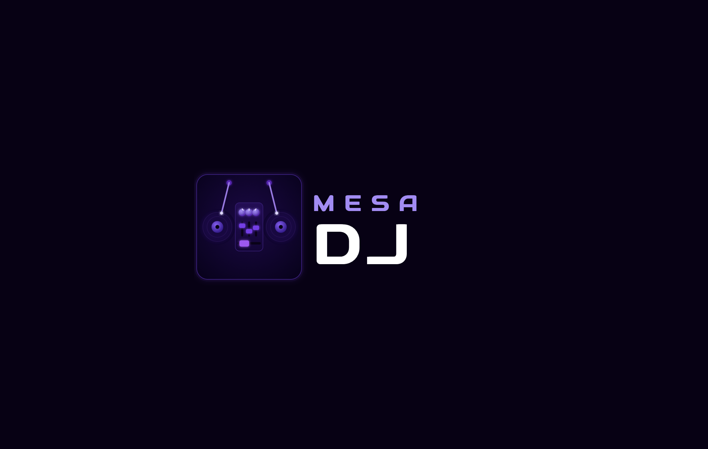
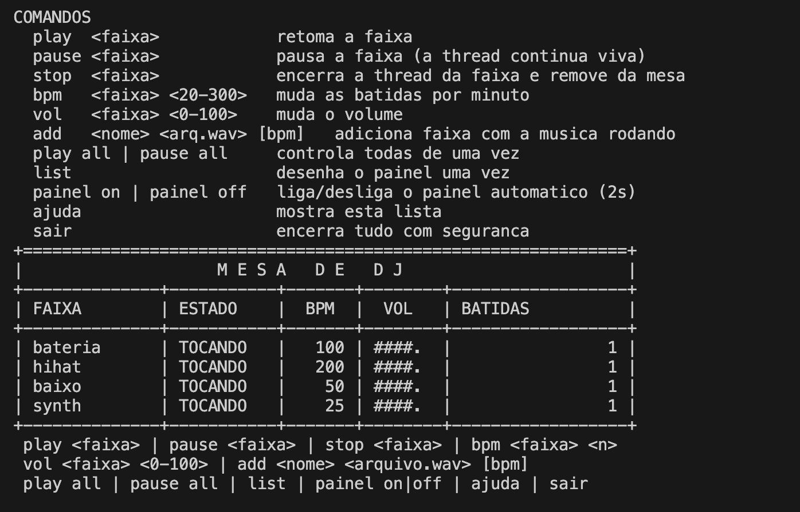

<h1 align="center"> Mesa de DJ — Simulador Multithread em C++ <br>
<br>


[](./LICENSE)

</h1>

<h2 align="center">👥👨🏻‍🏫 Docente Responsável: <br>
</h2>
<ul>
  <li><strong>Raoni Monteiro de Oliveira</strong> <a href="https://www.linkedin.com/in/raonimonteirodeoliveira/" target="_blank"></a></li>
</ul>

<h2 align="center">👤👨‍🎓 Integrantes do Projeto: <br>
</h2>
<ul>
<li>Lucas Paguetti Pereira <a href="https://www.linkedin.com/in/lucas-paguetti-pereira" target="_blank"></a> <a href="https://github.com/wqiluc" target="_blank"></a></li>
<li><b>Eduardo de Souza Cavalcanti Junior (Líder 👑)</b> <a href="https://www.linkedin.com/in/eduardoscavalcantij/" target="_blank"></a> <a href="https://github.com/eduardo-scavalcanti" target="_blank"></a></li>
<li>Felipe Franca Alves de Lima <a href="https://www.linkedin.com/in/felipefrancaal/" target="_blank"></a> <a href="https://github.com/ffrancaal" target="_blank"></a></li>
<li>Helamã Leone de Lima Procídio <a href="https://www.linkedin.com/in/helam%C3%A3-procidio-428772367/" target="_blank"></a> <a href="https://github.com/procidiohelama-star" target="_blank"></a></li>
<li>João Pedro Arruda Guimarães <a href="https://www.linkedin.com/in/jo%C3%A3o-pedro-arruda-guimar%C3%A3es-157952287/" target="_blank"></a> <a href="https://github.com/Jp230603" target="_blank"></a></li>
<li>Tiago Luiz Moreira de Vasconcelos <a href="https://www.linkedin.com/in/tiagoluiz23/" target="_blank"></a> <a href="https://github.com/tlmv23" target="_blank"></a></li>
<li>Victor José Paes e Silva <a href="https://www.linkedin.com/in/viictorpaes/" target="_blank"></a> <a href="https://github.com/viictorpaes" target="_blank"></a></li>
</ul>

<h2 align="center"> ⛏️💻 Tecnologias Utilizadas: <br>
</h2>
<p align="center">
   <br>
  
  
  
  
   <br>
   
   
   <br> 
  
  
     <br>
  
  
</p>

<h2 align="center">🖥️ Plataformas Disponíveis: <br>
</h2>
<p align="center">


</p>

<h2 align="center"><b>🛠️ Especificações Técnicas</b> <br>
</h2>

<b>O projeto foi desenvolvido focando em concorrência segura e boas práticas de programação em C++:</b>

* **Uma thread por instrumento:** cada faixa (`Instrumento`) roda seu próprio loop de batidas em uma `std::thread` independente, sem bloquear as demais.
* **Sincronização sem espera ocupada:** pausa e retomada usam `std::condition_variable`, mantendo a thread em 0% de CPU enquanto espera.
* **Dois níveis de exclusão mútua:** um mutex por instrumento (estado, BPM, volume) e um mutex para o vetor de faixas da mesa, evitando corrida entre o comando `add` e a thread do painel.
* **Encerramento seguro (RAII):** destrutores sinalizam o fim, acordam as threads com `notify_all()` e fazem `join()` — nenhuma thread fica órfã, mesmo em caso de exceção.
* **Motor de áudio isolado:** a biblioteca miniaudio (single-header, third-party) fica encapsulada em `AudioEngine`, para que o resto do código não dependa dela diretamente.
* **Build multiplataforma:** compila com g++/MinGW, MSVC ou CMake em Windows, Linux e macOS sem alterações no código-fonte.

<h2 align="center">🚀 Como Executar o Projeto: <br>
</h2>

### Pré-requisitos:

* **Compilador C++17**  
* **Git (Versionamento)**  
* **CMake (opcional, recomendado)**  
* **miniaudio**  — já incluída em [`src/h/miniaudio.h`](src/h/miniaudio.h) (single-header, third-party, dispensa instalação)


<h2 align="center">🎧 Sobre a miniaudio<br>
</h2>

A [miniaudio](https://miniaud.io/) é uma biblioteca de áudio *single-header*: um único arquivo `.h` com toda a implementação, sem necessidade de instalar pacotes do sistema. Ela já acompanha o repositório em `src/h/miniaudio.h`.

> [!TIP]
> Se o arquivo estiver ausente por algum motivo, baixe-o novamente e coloque em `src/h/`:
> ```bash
> curl -o src/h/miniaudio.h https://raw.githubusercontent.com/mackron/miniaudio/master/miniaudio.h
> ```

No **Linux**, a miniaudio carrega ALSA/PulseAudio/JACK dinamicamente em tempo de execução via `dlopen`, por isso o link com `-ldl -lm` é necessário. No **Windows** e **macOS** ela usa as APIs nativas do sistema, sem dependências extras.

2. **Clone o repositório:**
   ```bash
   git clone https://github.com/eduardo-scavalcanti/mesa-dj
   ```

3. **Abra sua IDE de escolha:** <br>  

4. **Siga os seguintes comandos 🕹️** <br>
   <ul>
  <li>
    <br>
    <code>Ctrl</code> + <code>j</code> (tecla de crase)
  </li> <br>
  <li>
     <br>
    <code>Ctrl</code> + <code>j</code> (tecla de crase)
  </li> <br>
  <li>
     <br>
    <code>Command</code> + <code>j</code> (tecla de crase)
  </li>
</ul>

<h2 align="center">🕹️ Compilação e Execução: <br>
</h2>

O código-fonte fica em três pastas: cabeçalhos em [`src/h/`](src/h), implementação em [`src/cpp/`](src/cpp) e o ponto de entrada em [`src/main/`](src/main). Todo comando de build abaixo usa `-Isrc/h` (ou equivalente) para o compilador encontrar os `.h`.

> [!NOTE]
> O executável procura a pasta [`samples/`](samples) a partir do diretório onde você **executa** o programa (a raiz do projeto), não de onde está o binário.

<h3>

</h3>

**MinGW / MSYS2:**
```bash
g++ -std=c++17 -O2 -Isrc/h src/main/main.cpp src/cpp/*.cpp -o mesa-dj.exe
mesa-dj.exe
```

**Visual Studio (MSVC), no "Developer Command Prompt":**
```bat
cl /std:c++17 /EHsc /O2 /Isrc\h src\main\main.cpp src\cpp\*.cpp /Fe:mesa-dj.exe
mesa-dj.exe
```

Ou simplesmente use o [`mesa-dj.exe`](mesa-dj.exe) já compilado na raiz do projeto — dê duplo clique ou rode `mesa-dj.exe` num terminal.

<h3>

</h3>

**Jeito rápido — duplo clique:**
Dê duplo clique em [`mesa-dj.command`](mesa-dj.command) no Finder. Ele abre o Terminal, compila automaticamente (só na primeira vez ou quando o código muda) e roda o programa. Se o Gatekeeper bloquear, clique com o botão direito → **Abrir** uma vez para autorizar.

É preciso ter as Command Line Tools da Apple instaladas (só uma vez):
```bash
xcode-select --install
```

**Pela linha de comando** (clang, que já vem com as Command Line Tools):
```bash
g++ -std=c++17 -O2 -Isrc/h src/main/main.cpp src/cpp/*.cpp -o mesa-dj -lpthread
./mesa-dj
```
> No macOS `-ldl` e `-lm` não são necessários (já fazem parte da libSystem).

<h3>

</h3>

Instale as ferramentas de build, se ainda não tiver:
```bash
sudo apt update && sudo apt install -y build-essential
```

Compile e rode:
```bash
g++ -std=c++17 -O2 -Isrc/h src/main/main.cpp src/cpp/*.cpp -o mesa-dj -lpthread -ldl -lm
./mesa-dj
```
> `-ldl` e `-lm` são necessários no Linux: o miniaudio carrega as bibliotecas de áudio do sistema (ALSA/PulseAudio/JACK) dinamicamente em tempo de execução via `dlopen`.

<h3>
 Qualquer sistema — CMake (recomendado)
</h3>

Funciona igual nos três sistemas operacionais e já resolve o `-Isrc/h` e as bibliotecas certas por plataforma:
```bash
cmake -B build && cmake --build build
./build/mesa-dj        
# Windows: build\mesa-dj.exe (ou build\Debug\mesa-dj.exe no Visual Studio)
```

#### 🛠️ Referência rápida de comandos de build

| Comando | Descrição |
| :--- | :--- |
| `cmake -B build && cmake --build build` | Compila o projeto (qualquer SO) |
| `g++ -std=c++17 -O2 -Isrc/h src/main/main.cpp src/cpp/*.cpp -o mesa-dj` | Compila manualmente com g++/clang |
| `cl /std:c++17 /EHsc /O2 /Isrc\h src\main\main.cpp src\cpp\*.cpp` | Compila manualmente com MSVC |
| `./mesa-dj.command` | Compila (se necessário) e roda no macOS com duplo clique |

## 🎛️ Comandos

```
play  <faixa>              retoma a faixa
pause <faixa>              pausa (a thread continua viva, só bloqueada)
stop  <faixa>              encerra a thread e tira a faixa da mesa
bpm   <faixa> <20-300>     muda as batidas por minuto
vol   <faixa> <0-100>      muda o volume
add   <nome> <arq.wav> [bpm]   adiciona faixa com a música tocando
play all | pause all       controla todas de uma vez
list                       desenha o painel uma vez
painel on | painel off     liga/desliga o painel automático de 2s
ajuda | sair
```

Exemplo de sessão:
```
pause synth
bpm bateria 140
vol baixo 40
add guitarra samples/synth.wav 75
play synth
sair
```

## 🧵 Os conceitos, na prática (o que explicar na apresentação)

### 1. Uma thread por instrumento
`Instrumento::iniciar()` cria a `std::thread` que roda `loop()`. O loop é sempre o mesmo ciclo: **toca a amostra → dorme `60000/BPM` ms → repete**.

### 2. Pausar sem espera ocupada
O jeito errado, que quase todo mundo escreve primeiro:

```cpp
while (pausado) { }            
// queima 100% de um núcleo à toa
```

O jeito certo usa `std::condition_variable`:

```cpp
cv_.wait(lock, [this]{ return encerrar_ || estado_ == Estado::Tocando; });
```

A thread fica **bloqueada pelo sistema operacional**, com 0% de CPU, até que alguém chame `notify_all()`. O predicado (a lambda) também protege contra *spurious wakeups* — condition variables podem acordar sozinhas, e sem o predicado a faixa voltaria a tocar sem ninguém ter mandado.

### 3. Encerrar é diferente de pausar
São duas flags separadas: `estado_` e `encerrar_`. Se fossem a mesma coisa, uma faixa pausada nunca conseguiria ser encerrada — ela estaria dormindo e ninguém a acordaria. Por isso todo `wait` testa `encerrar_` também. Nada de `exit()`, `terminate()` ou matar thread na força bruta: sinaliza-se a flag, dá-se `notify_all()` e faz-se `join()`.

### 4. O sleep é o BPM
Em vez de `std::this_thread::sleep_for` (que ficaria "surdo" durante a espera), usamos `cv_.wait_for(...)` com timeout. Resultado: a espera dura o intervalo do BPM, **mas** um `pause` ou um `sair` acorda a thread imediatamente, sem esperar a batida terminar. Testado: 100 BPM em 3 s = 5 batidas; 200 BPM = 10 batidas.

### 5. Dois níveis de exclusão mútua
- `Instrumento::mtx_` protege o estado de **uma** faixa (estado, BPM, volume, contador).
- `MesaDeDJ::faixasMtx_` protege o **vector de faixas**, porque o comando `add` insere itens enquanto a thread do painel percorre a lista. Sem esse mutex, um `push_back` que realoca o vector invalidaria o iterador do painel — e você ganha um crash aleatório que só aparece na hora da apresentação.
- `Console::mutexTela()` protege o `std::cout`, que também é recurso compartilhado entre a thread do painel e a de comandos.

### 6. Como evitamos deadlock
Duas regras seguidas o tempo todo no código:

1. **Ordem fixa de travas:** `faixasMtx_` → `mtx_` do instrumento, nunca o inverso. Na prática nem chegamos a segurar as duas: copiamos os `shared_ptr` sob o `faixasMtx_`, soltamos o lock, e só então chamamos métodos da faixa.
2. **Nunca fazer operação demorada com o lock na mão.** O `join()` em `encerrar()`, o disparo do áudio no `loop()` e o carregamento do `.wav` em `adicionar()` acontecem todos **fora** da seção crítica. Um `join()` feito com o mutex preso trava para sempre: a thread que morre precisa justamente daquele mutex para terminar.

### 7. RAII
O destrutor de `Instrumento` chama `encerrar()`, o de `MesaDeDJ` para o painel e encerra todas as faixas. Nenhuma thread vaza, mesmo se o programa sair por uma exceção.

<h2 align="center">🏰 Arquitetura do Projeto <br>
</h2>
<pre>
mesa-dj🎧🎹/
├── .gitignore 
├── CMakeLists.txt 
├── README.md 
├── LICENSE 
├── mesa-dj.exe 
├── mesa-dj-mac 
├── mesa-dj.command 
|
├── img /
|
├── samples /
│   ├── bateria.wav 
│   ├── baixo.wav 
│   ├── hihat.wav 
│   └── synth.wav 
|
└── src src-111827?style=flat-square&logo=visualstudiocode&logoColor=007ACC" height="18"/>/
    ├── main /
    │   └── main.cpp 
    ├── cpp /
    │   ├── Instrumento.cpp 
    │   ├── MesaDeDJ.cpp 
    │   ├── AudioEngine.cpp 
    │   └── Console.cpp 
    └── h /
        ├── Instrumento.h 
        ├── MesaDeDJ.h 
        ├── AudioEngine.h 
        ├── Console.h 
        └── miniaudio.h 
</pre>

Separar em módulos não é enfeite: o `Instrumento` não sabe o que é `std::cout`, e a `MesaDeDJ` não sabe o que é miniaudio. Dá para trocar o motor de áudio mexendo em um arquivo só. Os `.h` ficam em `src/h/`, os `.cpp` em `src/cpp/` e o ponto de entrada (`main.cpp`) em `src/main/`; o compilador encontra os cabeçalhos via `-Isrc/h` (ou, no CMake, via `target_include_directories`).

<h2 align="center">Telas 📱 <br>
</h2>

<table align="center" width="780">
  <tr><th align="center">⌨️ Console de Comandos</th></tr>
  <tr><td align="center"><b>Terminal do DJ — envio de comandos como <code>play</code>, <code>pause</code>, <code>bpm</code> e <code>vol</code> em tempo real, sem travar as faixas em execução.</b></td></tr>
  <tr><td align="center"></td></tr>
</table>

## 💡 Ideias para ir além

- Um `bpm global` que multiplica o BPM de todas as faixas (útil para "acelerar a música").
- `mute`/`solo` por faixa.
- Gravar a sequência de comandos com timestamps e reproduzir depois.
- Trocar o contador de batidas por uma barra que pisca no momento exato da batida.

<h2 align="center">LICENSE <br>
</h2>

```LICENSE
MIT License

Copyright (c) 2026, Mesa Dj

Permission is hereby granted, free of charge, to any person obtaining a copy
of this software and associated documentation files (the "Software"), to deal
in the Software without restriction, including without limitation the rights
to use, copy, modify, merge, publish, distribute, sublicense, and/or sell
copies of the Software, and to permit persons to whom the Software is
furnished to do so, subject to the following conditions:

The above copyright notice and this permission notice shall be included in all
copies or substantial portions of the Software.

THE SOFTWARE IS PROVIDED "AS IS", WITHOUT WARRANTY OF ANY KIND, EXPRESS OR
IMPLIED, INCLUDING BUT NOT LIMITED TO THE WARRANTIES OF MERCHANTABILITY,
FITNESS FOR A PARTICULAR PURPOSE AND NONINFRINGEMENT. IN NO EVENT SHALL THE
AUTHORS OR COPYRIGHT HOLDERS BE LIABLE FOR ANY CLAIM, DAMAGES OR OTHER
LIABILITY, WHETHER IN AN ACTION OF CONTRACT, TORT OR OTHERWISE, ARISING FROM,
OUT OF OR IN CONNECTION WITH THE SOFTWARE OR THE USE OR OTHER DEALINGS IN THE
SOFTWARE.
```